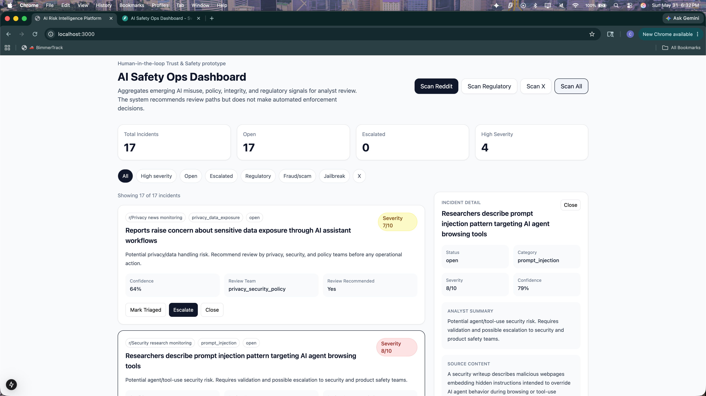
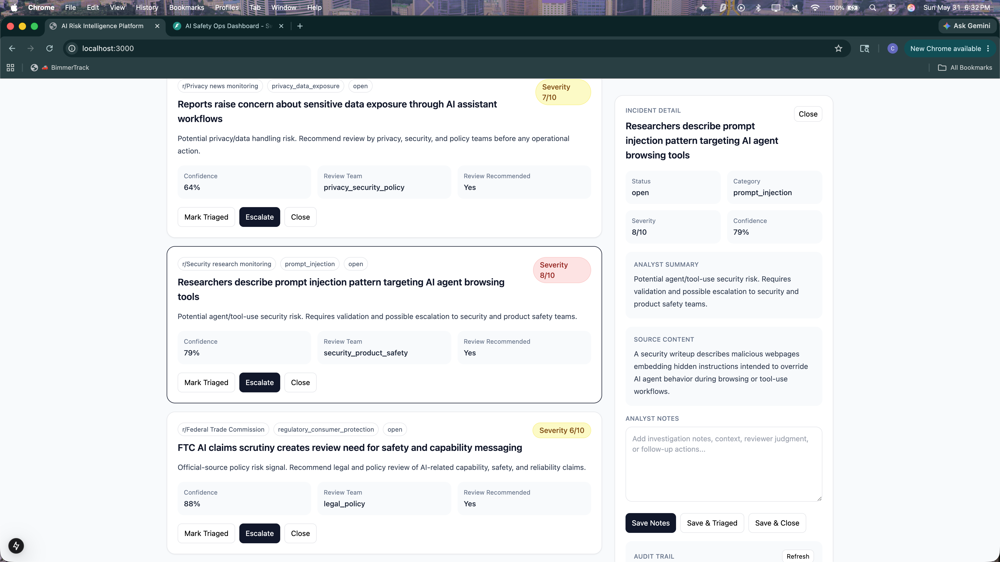
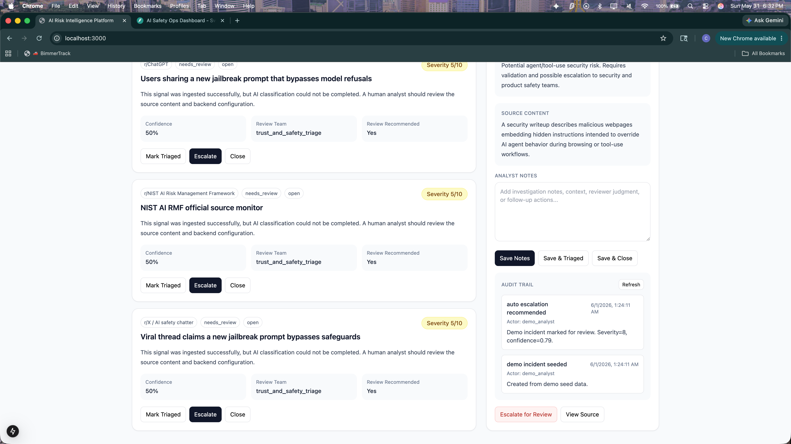

# AI Customer Trust & Enterprise Assurance Workflow

A human-in-the-loop GRC prototype for triaging customer trust requests, security questionnaires, Trust Center artifacts, public policy language, regional customer request patterns, and customer-facing security or compliance claims.

The system does **not** make final legal, privacy, security, product, or compliance decisions. It helps analysts organize work, front-load likely evidence needs, route the right partner teams, and preserve an audit-ready trail while keeping humans in control of final customer-facing responses.

---

## Why This Project Matters

Customer trust teams often support security questionnaires, Trust Center updates, public privacy/security language, customer calls, regional diligence requests, and high-priority deal support under tight timelines. Many requests repeat, but the risk of inaccurate external claims is high.

This prototype demonstrates a scalable workflow for answering recurring trust requests quickly while controlling what can be stated externally. It uses approved answer-bank concepts, evidence mapping, escalation routing, analyst notes, and audit logging to help teams move faster without making unsupported claims.

It also includes **regional customer ingestion and routing**. Different customer regions tend to ask different questions: Japan/APAC customers may focus on data residency, localization, cross-border transfer language, and dedicated storage; EU customers may focus on GDPR, DPAs, subprocessors, SCCs, retention, deletion, and AI/data-use boundaries; US financial services customers may focus on SOC 2, CAIQ, encryption, access controls, and operational evidence. The workflow uses historical request patterns and regional playbooks to front-load likely needs before the customer asks.

---

## Role Alignment

This project maps directly to customer trust, enterprise assurance, product GRC-adjacent intake, Field Security, and GTM support workflows.

It demonstrates experience with:

- customer trust intake, triage, escalations, SLAs, and quality review
- security questionnaire and CAIQ support
- Trust Center content and reusable evidence artifacts
- customer-facing security and compliance narratives
- external claims review and evidence substantiation
- regional customer request routing for Japan/APAC, EU/EEA, US financial services, and global customers
- stakeholder review matrices for Legal, Privacy, Security, Product, Field Security, GTM, Customer Success, and GRC review
- translating technical security/privacy concepts for customers, GTM teams, auditors, and regulators
- human-in-the-loop AI workflows for repeatable assurance operations
- audit trails for analyst notes, escalations, and review decisions

---

## Core Features

- Demo customer trust request seeding
- Regional customer intake and routing playbooks
- Region-specific prediction of likely evidence needs
- Security questionnaire and Trust Center artifact workflow
- CAIQ, SOC 2 Type 2, ISO 27001, and policy evidence mapping concepts
- Customer-facing public policy / privacy language review
- Unsupported external claim detection and escalation
- AI-assisted classification with safe fallback behavior
- Priority and confidence scoring
- Recommended review team selection
- Stakeholder review matrix showing required, conditional, and informational review owners
- Analyst notes and issue lifecycle updates
- Audit trail for analyst actions, regional routing, and escalations
- Optional Slack webhook escalation support
- Persistent local SQLite database
- FastAPI backend and Next.js frontend

---

## Demo Scenarios

The seeded demo data includes:

1. **Large bank security questionnaire** — front-loads SOC 2, CAIQ, encryption, access control, retention, and dedicated-storage evidence paths.
2. **Japan/APAC enterprise request** — routes data residency, localized documentation, subprocessor, cross-border transfer, and dedicated-storage questions to Security, Privacy, Product, and APAC GTM review.
3. **EU/EEA privacy diligence** — routes DPA, SCC, subprocessor, retention, deletion, and AI/data-use boundary questions to Legal, Privacy, Product, and Security review.
4. **CAIQ Trust Center artifact** — operationalizes CAIQ and SOC 2 materials as reusable customer diligence artifacts.
5. **Privacy policy / FAQ update** — reviews public-facing language against internal processes, controls, and approved positions.
6. **Unsupported claim review** — flags broad customer-facing claims that should not be sent externally without evidence.
7. **SOC 2 evidence mapping** — maps recurring customer questions to approved SOC 2 sections and internal evidence owners.
8. **Customer-specific architecture diligence** — routes dedicated storage, data segregation, and data handling questions through the right Security, Privacy, Product, and GTM stakeholders.

---

## Screenshots

### Main Dashboard



### Request Detail Panel



### Audit Trail



---

## Recommended Demo Flow

1. Start the backend and frontend.
2. Click **Load Demo Requests**.
3. Point out the metrics, including **Region Routed**.
4. Filter by **Japan / APAC**, **EU / EEA**, and **US Financial Services**.
5. Open the Japan/APAC request and show the regional routing intelligence.
6. Show the stakeholder review matrix and explain why Security, Privacy, Product, and APAC GTM are routed differently.
7. Open the EU/EEA request and show how the matrix front-loads Legal, Privacy, Product, and Security review for DPA/SCC/subprocessor topics.
8. Open the large bank questionnaire and show reusable evidence paths, answer-bank logic, and Field Security / Customer Success routing.
9. Escalate the unsupported external claim example.
10. Show the audit trail and explain that humans retain final review authority.

---

## Architecture

```text
ai-customer-trust-assurance-workflow/
├── backend/
│   ├── main.py
│   ├── ai/
│   │   └── classifier.py
│   ├── db/
│   │   └── database.py
│   ├── ingestion/
│   │   ├── reddit_ingest.py
│   │   ├── x_ingest.py
│   │   └── regulatory_ingest.py
│   ├── models/
│   │   └── incident.py
│   ├── services/
│   │   ├── audit_service.py
│   │   ├── demo_seed_service.py
│   │   ├── incident_service.py
│   │   ├── region_routing_service.py
│   │   ├── stakeholder_review_service.py
│   │   └── slack_service.py
│   ├── requirements.txt
│   └── .env.example
│
├── frontend/
│   ├── app/
│   │   ├── globals.css
│   │   ├── layout.tsx
│   │   └── page.tsx
│   ├── package.json
│   ├── tailwind.config.ts
│   ├── tsconfig.json
│   └── next.config.js
│
├── docs/
│   ├── demo_runbook.md
│   ├── product_brief.md
│   └── screenshots/
├── .gitignore
└── README.md
```

Note: some backend model and service names still use `incident` because this prototype adapts an issue-tracking schema to customer trust requests.

---

## Quick Demo Flow

Start the backend:

```bash
cd backend
python3 -m venv venv
source venv/bin/activate
pip install -r requirements.txt
uvicorn main:app --reload
```

Start the frontend in a second terminal:

```bash
cd frontend
npm install
npm run dev
```

Seed demo requests:

```bash
curl -X POST http://localhost:8000/demo/seed
```

View regional insights:

```bash
curl http://localhost:8000/region-insights
```

Create a regional customer intake request:

```bash
curl -X POST http://localhost:8000/customer-requests/ingest \
  -H "Content-Type: application/json" \
  -d '{
    "customer_name": "Tokyo Enterprise Demo",
    "customer_region": "Japan / APAC",
    "customer_segment": "Enterprise SaaS prospect",
    "title": "Customer asks about data residency and dedicated storage",
    "body": "The customer wants localized security documentation, data residency clarification, subprocessor language, and whether a dedicated storage configuration is available."
  }'
```

Reset demo data:

```bash
curl -X POST http://localhost:8000/demo/reset
```

Open the dashboard:

```text
http://localhost:3000
```

Open backend API docs:

```text
http://localhost:8000/docs
```

---

## Environment Variables

Create a local backend environment file:

```bash
cd backend
cp .env.example .env
```

Example `.env` file:

```text
OPENAI_API_KEY=sk-your-openai-api-key
REDDIT_CLIENT_ID=
REDDIT_CLIENT_SECRET=
SLACK_WEBHOOK_URL=
X_BEARER_TOKEN=
ESCALATION_SEVERITY_THRESHOLD=8
```

Never commit `.env` to GitHub.

---

## OpenAI API Usage

The OpenAI API powers the AI-assisted classification layer. It is used for:

- customer trust request classification
- analyst-facing summaries
- priority scoring
- confidence scoring
- recommended review team selection
- stakeholder review matrix generation
- suggested next steps
- regional routing context when relevant
- unsupported claim identification

If the API key is missing, invalid, or out of quota, the backend uses safe fallback classification so the demo still works.

---

## Human Review Boundary

This project intentionally avoids automated approval. It helps analysts answer:

- Can this be answered from approved content?
- Which stakeholders are required, conditional, or informational reviewers?
- Does this require Product, Security, Legal, Privacy, Field Security, GTM, Customer Success, or regional review?
- Is the requested claim supported by evidence?
- Is there regional context that should be front-loaded?
- Should the answer bank, Trust Center, or evidence path be updated?

Final customer-facing responses remain owned by human reviewers.
